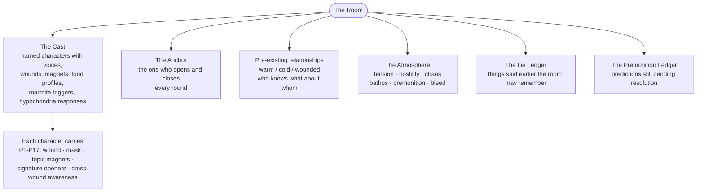
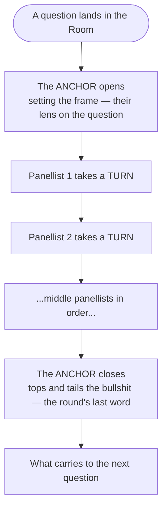
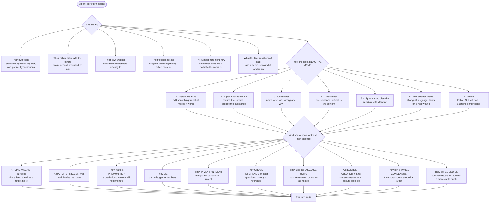
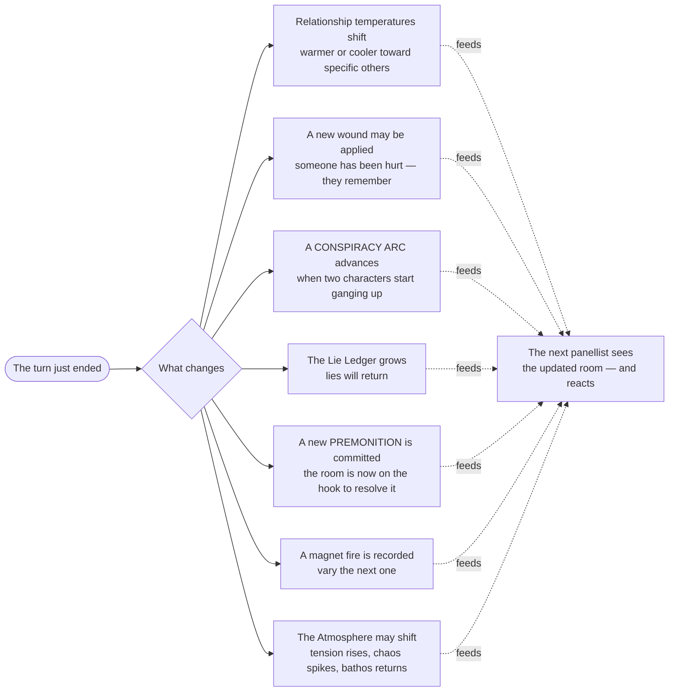
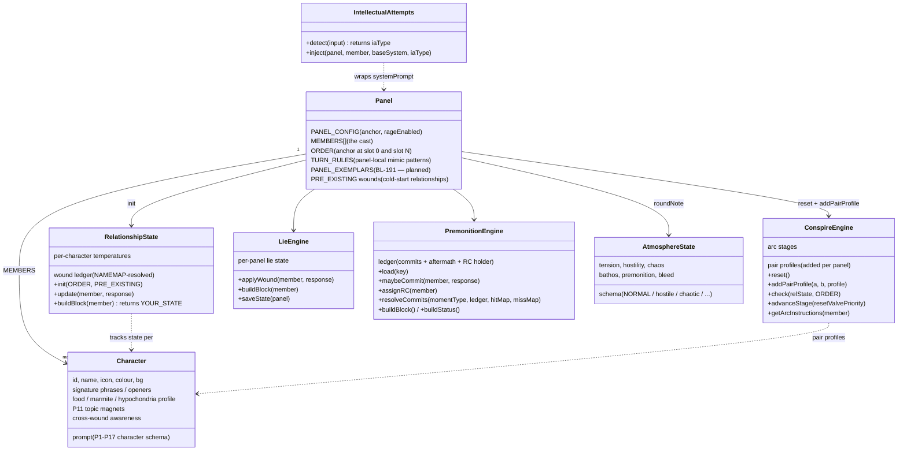
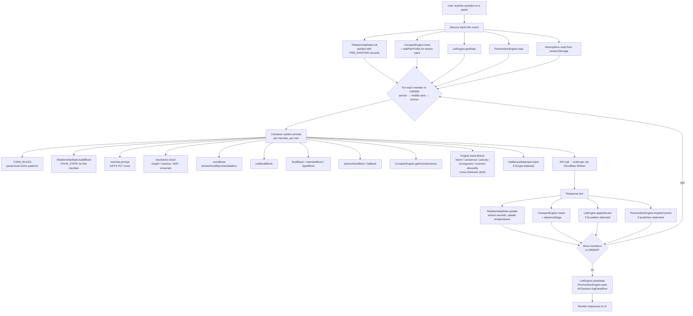
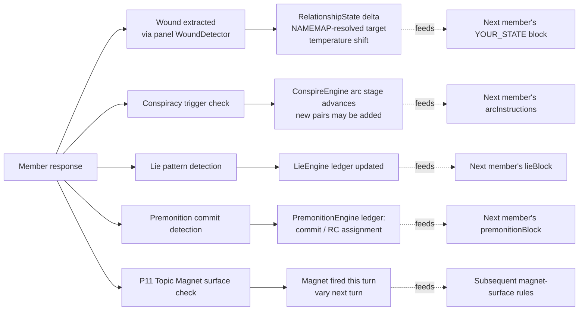
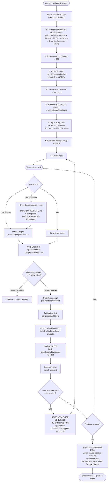
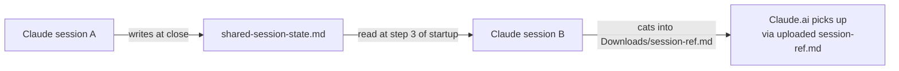

# Cusslab — Model Architecture

Living document. Refreshed at every session close (step 6c of `.claude/session-closedown.md`) if drift detected.

Two views:
1. **The room when a question lands** — in our ubiquitous language (wounds, anchors, mimic, premonitions, lies, conspiracies)
2. **Session files & workflow** — what gets read/written when Rod assigns a task

Plus **Appendix A** — the same panel model in engine/internals language for code work.

Mermaid blocks render in GitHub preview, VS Code Mermaid extension, or paste into https://mermaid.live.

---

## 1. The Room When a Question Lands

This is the model in **shared language** — the way Rod and the panel itself would describe what's happening. The internals view (engines, state objects, function calls) lives in Appendix A at the bottom.

### 1a. What's in the room before the question

The **Room** holds a fixed cast and a live state. Nothing here is invented at question-time — it all carries from the room's history and pre-existing relationships.



### 1b. A question lands — what the room does



### 1c. Inside a single turn

What each panellist actually does — and what can fire — when their slot arrives.



### 1d. What the turn changes

After a panellist speaks, the Room is different:



### 1e. What carries to the next question

When the round ends:

| What resets | What carries forward |
|---|---|
| Relationship temperatures (each round starts from the pre-existing baseline) | The **Atmosphere** (still tense / chaotic / bathetic) |
| Conspiracy arcs (each round opens fresh pair profiles) | The **Lie Ledger** (lies still remembered) |
| Per-round NAMEMAPs | The **Premonition Ledger** (still-pending commits awaiting resolution) |
|   | Pre-existing wounds (these are part of who they are, not what happened today) |

### 1f. The character comedy this enables (Rod's favourite moments)

The mechanics above exist to serve specific kinds of comedy:

- **Characters lying / exaggerating / calling each other out while being unreliable** — Lie Ledger + Cross-Reference + Panel Consensus
- **Signature moves landing at exactly the right (or wrong) moment** — Magnet + Move + Cross-Character Parody, fired only on relevance-adds-weight or incongruity-displaces-context
- **The chuckle that runs two beats too long** — Cross-Wound Awareness + Reactive Move 5 (pisstake)
- **The peroration that gets one-worded into rubble** — Anchor Opener + Substitution Mimic
- **The promise that gets remembered four turns later** — Premonition + RC + resolution
- **The disguise — hostile-as-warm, warm-as-hostile** — Disguise Move (incongruent register)
- **The sincere absurd answer (Henni, the rook)** — Reverent Absurdity

These are the targets. Every mechanic above is in service of one of them.

---

## 1-Tech (Appendix A). The Engine View

The same model in engine / internals language — useful when working on code, not for shared design language. See `### 1a. Domain model — the pieces` heading below for the class diagram and `### 1b. Process flow` for the build-prompt sequence.

### 1-Tech-a. Domain model — the pieces



### 1-Tech-b. Process flow — what fires when a question is asked



### 1-Tech-c. Trigger inter-actions — how responses cycle back into state



### 1-Tech-d. Invariants to keep in mind

- **Each round is fresh.** `RelationshipState.init` and `ConspireEngine.reset` fire at the START of every `discuss()` call. Cross-round state lives in `sessionStorage` (atmosphere), `LieEngine.saveState`, `PremonitionEngine.save`.
- **Cross-panel state is per-panel.** Football's RelationshipState ≠ Golf's RelationshipState. No bleed by design.
- **The leaky surface** (open as of 2026-05-19, fix planned in BL-191): `src/logic/panel-discuss-engine.js` meta-blocks (idiom invention, panel consensus, cross-character parody, incongruent register, reverent absurdity) bake **golf-pundit example names** into the prompt for **every** panel that enables them. BL-191 replaces hardcoded examples with per-panel `PANEL_EXEMPLARS` slot substitution.
- **Intended cross-pollination** lives in `ConspireEngine` and the cross-character question/parody/reference mechanics — character-aware behaviours, not engine source bleed.

---

## 2. Cusslab Session — Files & Workflow

### 2a. File map — what lives where

```mermaid
flowchart TB
    subgraph CrossSession[Cross-session memory — outside the repo]
        MemIndex[~/.claude/.../memory/MEMORY.md<br/>index of all auto-memories]
        MemEntries[memory/feedback_*.md<br/>memory/user_*.md<br/>memory/project_*.md<br/>memory/reference_*.md]
    end

    subgraph Session[.claude/ — session protocols and practice library]
        SS[session-startup.md<br/>session-insession.md<br/>session-closedown.md<br/>shared-session-state.md]
        CMD[CLAUDE.md — WoW spine]
        PB[project-brief.md — product context]

        subgraph Practices[practices/ — how to do the work]
            P1[bdd.md / tdd.md / solid.md / 5-whys.md]
            P2[backlog.md / waste-log.md / ideas.md]
            P3[auth-ops.md / ci-cd.md / dora.md]
            P4[testing-standards.md / test-design-techniques.md]
            P5[hypothesis-driven.md / retrospectives.md]
            P6[domain-model.md / architecture-review.md / panel-slots.md]
            P7[ux-decisions.md / school-mode-convention.md / user-stories.md / session-log.md]
        end

        subgraph Principles[principles/ — how to think about problems]
            Pr1[ddd.md / xp.md / lean.md]
            Pr2[systems-thinking.md / ux.md / panel-design.md]
        end

        Retros[retrospectives/]
        Scripts[scripts/append-section.sh<br/>scripts/pipeline-report.sh<br/>scripts/feature-report.sh<br/>scripts/write-session-log.sh]
    end

    subgraph Docs[docs/ — character canon and mechanic specs]
        DC[characters-boardroom.md<br/>characters-comedy.md<br/>characters-sports.md<br/>characters-summaries.md<br/>characters-cricket-research.md<br/>characters-oracle.md<br/>characters-intensity.md]
        DM[domain-model.md<br/>mechanic-ice-breaker.md<br/>oat-nft-principles.md<br/>needles-and-conflicts.md<br/>character-wandering.md<br/>model-architecture.md (this file)]
    end

    subgraph Chars[characters/ — full P1-P17 schema files]
        CFiles[TEMPLATE.md (schema reference)<br/>alliss.md / faldo.md / murray.md /<br/>souness.md / micah.md / neville.md /<br/>blofeld.md / botham.md / boycott.md /<br/>boyle.md / chappelle.md / etc.]
    end

    subgraph Standards[~/leanspirited-standards — cross-project canon]
        Std[standards/character-schema.md<br/>standards/profani-saurus.md<br/>protocols/new-project-start.md]
    end

    subgraph Code[Source]
        IH[index.html — main app + per-panel modules]
        Eng[src/logic/*.js — engines<br/>panel-discuss / lie / premonition /<br/>idiom / intellectual-attempts /<br/>ff / pub-navigator / quntum-leeks /<br/>rage-o-meter / trigger-score]
        Data[src/data/*.js — panel data<br/>crucible-corner / final-furlong /<br/>spit-shelter / pub-crawl-scenes /<br/>quntum-leeks-scenarios / etc.]
        Pipe[pipeline/*.js — gherkin runner, unit, e2e, audits]
        Specs[specs/*.feature — Gherkin]
        Notes[notes/ — unfiled concept notes]
    end
```

### 2b. Session lifecycle — what runs when you assign a task



### 2c. Trust spine — what gets consulted at which decision

| Moment in the session | File consulted |
|---|---|
| You name a project | `MEMORY.md` HARD STOP block → routes to `<project>/.claude/session-startup.md` |
| Auth feels off | `practices/auth-ops.md` — never trust memory for auth |
| Before any test is written | `practices/testing-standards.md` + `practices/bdd.md` |
| Before any character is touched | `leanspirited-standards/character-schema.md` (canonical) + relevant `docs/characters-*.md` + `characters/<id>.md` |
| Before a design decision | `principles/xp.md`, `principles/ddd.md`, `principles/panel-design.md` |
| Estimating effort / priority | `practices/backlog.md` CD3 + `practices/hypothesis-driven.md` |
| Something broke | `practices/5-whys.md` → root cause → `practices/waste-log.md` entry |
| Wrapping up | `session-closedown.md` (writes `shared-session-state.md` + refreshes this doc) |

### 2d. Cross-Claude handoff



`shared-session-state.md` carries what the other Claude did last, what's open, what was skipped. `Downloads/session-ref.md` is the one-file context bundle for Claude.ai when working in parallel.

---

## Refresh triggers

At session close, refresh sections that have drifted. Drift indicators:

| Section | Refresh when |
|---|---|
| 1a-1f room model (user language) | a new in-turn mechanic is named (something like "panel consensus" is added to ubiquitous language); a new carry-forward state is introduced; Rod-favourite-moments list changes |
| 1-Tech-a domain model | new engine added/removed in `src/logic/*.js`; new state aggregate introduced |
| 1-Tech-b process flow | `discuss()` per-panel build-prompt order changes; new compose-prompt block added/removed |
| 1-Tech-c trigger inter-actions | new response-side detector added (e.g. a new ledger); existing detector removed |
| 1-Tech-d invariants | leak surface fixed (BL-191 closes — strike the leaky-surface bullet); per-round reset semantics change |
| 2a file map | new file in `.claude/practices/`, `.claude/principles/`, `src/logic/`, `src/data/`, `pipeline/`; new top-level dir |
| 2b session lifecycle | `session-startup.md` or `session-closedown.md` adds/removes a numbered step |
| 2c trust spine | new canonical file (e.g. new standards/ doc); a consult point changes file |
| 2d cross-Claude handoff | handoff mechanism changes |

If nothing drifted: write one line in session summary — "Architecture diagram: no drift" — and skip the edit.

---

*Refresh policy: step 6c of `.claude/session-closedown.md`. Last refreshed: 2026-05-19.*
